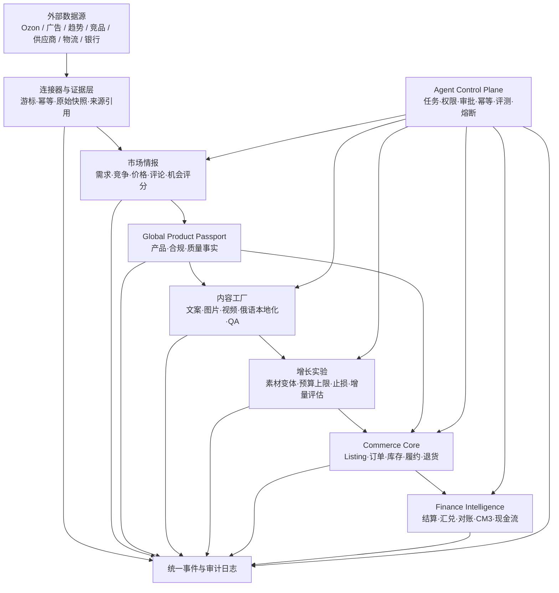

# KJDS 整体架构与演进边界

## 设计结论

系统从第一版就保留完整业务域，不按页面或 Agent 名称拆系统。首期采用模块化单体和事务事件表，验证业务后再按负载、团队与故障边界拆服务。拆分时保持实体 ID、API、事件名称和数据所有权不变，因此不需要重写业务核心。



## 数据如何产生

所有数据分成四级，不能混用：

1. **原始证据**：平台导出/API 响应、网页快照、供应商报价、物流账单、银行流水。只追加，不覆盖。
2. **标准事实**：统一 SKU、币种、时间、国家、订单和费用分类后的可信事实。
3. **分析特征**：需求增长、竞争强度、价格带、评论痛点、物流风险、退货概率、贡献利润。
4. **决策与动作**：机会评分、内容 Brief、广告实验、补货建议、淘汰建议；必须反向引用证据。

每条外部数据都必须保存 `source`、`source_ref`、`observed_at`、`ingested_at`、`confidence` 和维度。没有来源的数据可以作为假设，不能作为自动执行依据。

## 如何用数据抢市场

市场情报不输出一份泛泛报告，而是连续运行的机会漏斗：

```text
候选关键词/类目
→ 需求趋势与价格带
→ 竞品密度和评论痛点
→ 可供应性、合规和物流校验
→ 预估 CM3 与现金周期
→ 小样和内容变体
→ 小预算实验
→ 按增量 CM3 放大或淘汰
```

机会评分不是黑箱。每个分数保留指标、权重、观察样本和来源 ID；模型可升级，历史决策仍可复算。

## 图片、视频与内容生产线

内容资产由固定状态机管理：

```text
Brief → Generated → QA Failed / Approved → Experiment → Published
```

Brief 只能读取已批准的 Product、Compliance、Quality Passport，避免模型虚构材质、尺寸、认证和功效。图片、视频和俄语文案发布前必须通过：

- 事实一致性；
- 平台和广告政策；
- 俄语本地化；
- 商标、著作权、肖像和素材授权；
- 品牌一致性。

生成模型被放在适配器层。以后替换图片或视频模型，只增加 Provider，不改变 ContentAsset、审核、实验和发布流程。

## 不重搭的关键约束

- 业务实体使用平台无关 ID，Ozon ID 只作为外部映射。
- 外部平台只能通过 Connector 接入，Agent 不直接保存平台密钥。
- 领域事件使用稳定命名，例如 `market.observation_ingested`、`content.reviewed`、`order.created`。
- 金额使用十进制定点数，保存原币、汇率、日期和证据。
- 高风险动作走 Approval，申请人与批准人分离。
- Agent 调用必须有 idempotency key，失败可以安全重试。
- 内容文件进入对象存储，业务库只保存引用和元数据。
- 分析库、向量库、消息队列都是可替换基础设施，不拥有业务事实。

## 服务拆分触发条件

只有满足下列条件之一才从模块化单体拆服务：

- 某模块吞吐量或算力需求明显独立，例如图片/视频渲染；
- 某模块需要单独扩缩容或故障隔离，例如平台连接器；
- 团队所有权长期稳定且接口已经成熟；
- 合规要求必须物理隔离数据。

推荐未来首先拆出 `connectors`、`content-workers` 和 `analytics-pipeline`。商品主数据、审批、订单状态与财务账本保持强一致核心。

## 当前实现与下一增量

当前已经建立领域模型、API 契约、事件名称、数据库迁移和测试用内存适配器。下一增量应按以下顺序实现：

1. PostgreSQL 持久化适配器和事务 outbox；
2. Ozon 手工导入连接器，随后替换为 API 连接器；
3. 对象存储和图片/视频 Worker；
4. 原始数据分区、标准化任务与机会看板；
5. 身份、角色、密钥托管和生产审计；
6. 广告、物流、结算连接器及自动对账。
