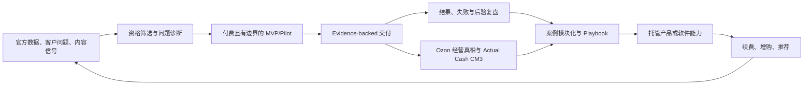

# 一人主责、多人制衡的双引擎经营系统

| 元数据 | 值 |
|---|---|
| doc_id | KJDS-OPS-014 |
| owner | 经营负责人 |
| accountable | Business Owner |
| status | Active operating contract |
| version | 1.0 |
| reviewed_at | 2026-08-03 |
| related_adr | ADR-0089 |

## 1. 总目标

用同一个可复核系统同时完成两件事：

1. 在俄罗斯/Ozon 跑通从需求、采购、内容、上架、订单、履约、结算到人民币到账的真实闭环。
2. 把闭环中重复出现且被证据证明有效的能力，产品化为诊断、托管服务、隔离工作台和最终 SaaS。

北极星不是 GMV、粉丝数或 Agent 调用量，而是：

```text
可归因的增量 Actual Cash CM3
+ 客户获得的可验证价值
- 获客、交付、模型、人工、售后和错误成本
```

当前 Actual Cash Profit 仍为 `no_data`，利润增长阈值仍为 `UNKNOWN`。本合同不改变任何现有 Gate。

## 2. 从素材吸收什么，不吸收什么

### 2.1 吸收的机制

- 用真实问题而不是功能列表定义产品。
- 用短内容测试需求，用长内容建立决策信任。
- 内容负责筛选匹配客户，不追求所有流量。
- 先卖边界清晰的付费 MVP，再用交付结果反推产品。
- 把案例拆成可复用模块，让后台系统反哺销售和交付。
- 算法/通用内核与行业/客户交互层解耦。
- 用后验结果更新判断，而不是守着一次性方案。

### 2.2 不直接采用的声明

- 素材中的收入、客单价、成交和客户结果均是未独立核验的第三方自述。
- “数学建模”“认知工程”“高级智能体”等名词不等于已验证算法、因果效果或商业壁垒。
- 不复制素材价格，不承诺确定收益，不把个案当市场规模。
- 不把 Markdown 或一对一辅导本身当护城河；护城河必须来自真实数据权威、闭环执行、切换成本和持续结果。

## 3. 统一经营飞轮



每次循环都必须产生以下之一：可接受 Evidence、明确失败、可复用模块、被否决的假设或新的 UNKNOWN。只产生内容、页面或模型输出不算闭环。

## 4. 前台、中台、后台与四条控制轨

| 系统 | 核心问题 | 标准输出 | 主要指标 | 失败关闭条件 |
|---|---|---|---|---|
| 前台：定位与流量 | 谁正在经历什么高价值问题 | 问题假设、内容实验、合格线索 | 合格问题率、内容到诊断率 | 无来源、无 ICP、只追粉丝量 |
| 中台：诊断与成交 | 是否值得付费解决，范围是什么 | 诊断、价值假设、Pilot 合同、拒绝理由 | 诊断到付费 Pilot、销售周期 | 无决策人、无数据授权、要求违规自动化 |
| 后台：交付与产品化 | 如何稳定产生可验证结果 | Evidence、结果复盘、模块、SOP、案例 | 首次价值时间、交付毛利、模块复用率 | 无基线、无结果读回、无法归因 |
| 客户成功 | 价值是否持续并可续费 | 采用计划、风险队列、续费/停止决定 | 采用率、续费率、支持成本 | 只看登录量、不看业务结果 |
| 利润与现金轨 | 是否真的增收降本 | 四账、十五项成本、Actual Cash CM3 | 到账覆盖、费用解释率、现金占用 | 用预测替代结算/到账 |
| Evidence 与合规轨 | 声明能否复核 | 原件、哈希、血缘、时效、复核 | 完整率、过期率、事实污染率 | 第三方营销声明直接晋升 Fact |
| 身份与权限轨 | 谁能看、批、执行 | exact scope、SoD、Approval、Permit | 越权为 0、撤销可验证 | 一人或 Agent 自审自批 |
| 平台与 AI 轨 | 如何可靠复用能力 | versioned Skill、trace、eval、回滚 | 安全有效交付率、成本、缺陷逃逸 | 模型输出直接外写或入账 |

## 5. 逆漏斗获客

### 5.1 内容合同

每条内容只做一件事：描述一个可识别问题、给出一个可验证框架、声明边界，并把读者引导到一个诊断动作。

- 短内容：验证问题是否真实存在，记录受众、问题、证据来源、CTA 和结果窗口。
- 长内容：解释因果链、常见误判、数据要求、失败条件和案例边界。
- 案例内容：必须有客户许可和脱敏方案；结果包含基线、干预、窗口、反事实限制和成本。
- 禁止：保证收益、伪造截图、隐藏成本、把相关性说成因果、用客户原始数据训练跨租户模型。

### 5.2 资格门

进入诊断至少需要：目标市场与经营主体明确、存在可量化问题、能接触必要数据、决策人参与、接受 Evidence 与复核边界。以下情况直接拒绝或延期：

- 要求无证据保证 GMV、利润或排名。
- 要求绕过 Ozon、税务、制裁、商品标识、知识产权或账户规则。
- 不允许基线和结果读回，却要求按结果归因。
- 要求共享密钥、Cookie、他人客户数据或越权操作。
- 问题不是重复发生，或人工一次解决的总成本更低。

## 6. 产品与报价阶梯

| 层级 | 客户购买的结果 | 交付边界 | 晋级条件 |
|---|---|---|---|
| 公开内容 | 判断问题是否值得处理 | 无客户数据、无经营承诺 | 产生合格诊断需求 |
| 付费诊断 | 现状、阻断、价值假设和行动顺序 | 只读、Evidence-backed | 形成双方签署的 Pilot 问题 |
| 受控 Pilot | 一个窄问题的可测改善 | 单主体/单店/限定 SKU，外写默认关闭 | 结果可复核且交付经济性成立 |
| 托管实施 | 可重复工作流和团队采用 | 隔离部署、SOP、培训、支持 | 同模块在独立客户重复付费 |
| 隔离订阅 | 持续诊断、队列和决策支持 | 不宣传自助多租户 | 权限、计费、恢复、SLA 通过 |
| SaaS | 标准化自助产品 | G7 后，多租户与法务单独验收 | 三家以上重复需求且单位经济成立 |

在 `C0 Commercial Pilot Gate` 通过前，只能准备销售资产和发布不含商业承诺的公开教育内容；
付费诊断、付费 Pilot、报价、成交、收款和应收全部禁止。自助多租户 SaaS 还必须通过 G7。

价格必须有版本化实验、客户范围、交付成本、最大损失和失效条件。素材中的 `3980/5980` 或其他数字不进入价格表。

## 7. 俄罗斯电商与软件的双向反哺

### 7.1 电商引擎给软件什么

- 官方 Ozon 商品、财务、订单、结算与读回合同。
- SKU 身份、十五项成本、FX、物流和退货的真实失败样本。
- 从内容、转化、履约到现金的可归因结果。
- 经营人员实际使用中的摩擦、支持成本和权限边界。

### 7.2 软件引擎给电商什么

- 证据采集与缺口队列，减少反复找资料。
- 利润真相、止损和现金占用提醒，防止盲目扩量。
- 选品、报价、Listing、履约和售后的标准化 Playbook。
- 受限 Agent 提案、对照实验和复盘，降低人工认知负荷。

### 7.3 数据防火墙

 owned store、设计伙伴和 SaaS 客户的原始数据严格 exact-scope 隔离。跨客户只能复用以下对象：公开规则、客户明确许可且脱敏的案例、无主体可逆性的聚合模式、版本化通用 Skill 和测试夹具。任何共享都保留来源、许可、有效期和撤销路径。

## 8. 前沿技术如何进入项目

机器真源是 `docs/project/registries/frontier_technology_adoption.json`。采用顺序如下：

1. 先加深现有 `GovernedAgentRuntime`、Evidence、Graph、Outbox、PostgreSQL 和 G1。
2. 再用隔离基准证明新技术比现有方案在质量、成本、延迟或恢复上更好。
3. 只有出现真实重复痛点，才增加运行基础设施。
4. 每个试点必须可删除、可回滚、无生产凭据、无外写权限。

| 业务问题 | 当前首选 | 前沿增强 | 当前边界 |
|---|---|---|---|
| Agent 质量与成本 | 现有 trace/eval/routing | OTel GenAI 语义、持久 eval ledger、分层模型路由 | 输出仍为 proposal |
| 长任务恢复 | 现有状态机 + Outbox | durable workflow adapter 基准 | 未证明痛点前不引入 Temporal |
| 复杂知识检索 | Evidence + canonical Graph | 因果/时间 GraphRAG 基准 | 先与 SQL/全文检索比较 |
| 工具互操作 | 现有 provider protocols | MCP 2026-07-28 OAuth、草案 Tasks 扩展、A2A 适配 | 不让协议成为权限 Owner；不在 SDK 支持前升级线协议 |
| 供应链安全 | G1 secret/image checks | SLSA provenance、SBOM、AI-BOM | 先覆盖发布物，不扩大运行面 |
| 数据平台 | PostgreSQL 17 | PostgreSQL 18 隔离回放和性能基准 | 不直接升级生产 |
| 浏览器读回 | Seller API/正式导出优先 | Playwright/WebDriver BiDi 隔离适配 | 不保存 Cookie，不替代官方接口 |
| 高吞吐分析 | PostgreSQL 投影 | ClickHouse/Iceberg 观察 | 无规模触发，不建设第二真源 |
| 本地推理 | 云/可替换模型端口 | torchao 量化基准 | 无隐私/成本收益前不部署 |

## 9. 多线程调度

A-E 泳道当前执行租约的机器真源是
`docs/project/registries/active_workstream_assignments.json`。动态计划中的历史
`IN_PROGRESS` 表示任务尚未收口，不等于当前持有共享写租约；只有执行租约注册表中的
`current_task` 计入 WIP。共享 migration、`api.py` 聚合入口和 `MASTER_SPEC` 写入仍必须由
单一集成人持有显式租约。

| 泳道 | 唯一职责 | 当前输出 | 共享写限制 |
|---|---|---|---|
| A 经营真相 | Ozon、供应链、财务、现金 | 一手 Evidence 与 Gate 状态 | 不改 Agent/runtime |
| B 商业发现 | 内容、诊断、设计伙伴、产品阶梯 | 问题实验与付费 Pilot 合同 | 不改利润口径 |
| C 产品工程 | 深模块、Web、Agent、eval | 版本化能力和测试 | 共享 migration 单一集成人 |
| D 商业底座 | 订阅、entitlement、部署、SLA | 内部账与交付包 | 不接外部支付前不声称收款 |
| E 风险与复核 | 合规、安全、Evidence、红队 | 独立结论与否决条件 | 不由被审对象代签 |

每条泳道最多一个主任务 `IN_PROGRESS`。跨泳道变更先冻结 ADR、输入输出合同和文件所有权；代码、测试、Evidence、迁移和 Git 提交必须精确归属。

### 9.1 Governed TeamAgent 自学习进化

机器合同继续复用 `docs/project/registries/loop_engineering_registry.json`，不再建设第二套
Agent 真相。TeamAgent 采用 coordinator + bounded specialists + independent verifier：研究、
Evidence、产品、财务、风险、执行各自拥有独立 identity、exact scope、工具白名单、预算、
handoff 和 trace；协调者不能代替独立复核或签发 Permit。

```text
human correction / verified failure / evidenced outcome / official source change
  -> Observation
  -> versioned SkillCandidate or Graph candidate
  -> frozen EvalSet + baseline
  -> negative/scope/security tests
  -> Shadow run
  -> independent Review
  -> Gate promotion or rollback
  -> continuous outcome monitoring and expiry
```

持续成长可以更新五类对象：知识图谱节点/边、Skill/Prompt 模板、模型路由、工具合同和工作流
策略。每类都必须有版本、来源哈希、有效期、评测、Owner 和回滚。运行时禁止自改代码、
数据库结构、权限、Fact、FinanceEntry、Approval、Permit 或 external write；代码改进仍必须进入
隔离 Worktree、测试、审查和 Git 提交。跨租户只允许使用获许可、脱敏、不可逆且可撤销的
模式级知识，任何模型或 Graph 生成内容在独立晋升前都只是 Observation。

## 10. 当前执行顺序

1. `BAS-171` 冻结本经营合同、研究证据和前沿采用注册表。
2. `BAS-172` 把现有 Agent trace/eval 变成可持久审计、可回放、可比较的运行证据，不保存敏感正文。
3. `BAS-173` 用真实失败问题建立 SQL/全文/Graph/因果时间检索金标基准，胜出后才决定是否加 pgvector。
4. `BAS-174` 只对跨小时、需人工等待和可重放的工作流做 durable adapter 基准；未满足触发条件保持不安装。
5. `BAS-175` 为一个发布物建立 SLSA provenance 与 SBOM/AI-BOM 验证，不与数据库升级绑死。
6. `BAS-176` 单独执行 PostgreSQL 18 隔离回放、性能、恢复与回滚 Pilot，未过 exit Gate 不升级基线。
7. `BAS-177` 在 BAS-172/173 上建立 Governed TeamAgent 自学习进化 Loop，所有成长都经过 eval、shadow、独立复核、晋级和回滚。
8. 商业侧并行补齐真实订单、结算、银行到账、阈值签署和首个付费设计伙伴；这些输入不能由工程模拟。

## 11. 周复盘问题

- 本周哪一个真实问题被证明值得付费解决？
- 哪个交付结果有完整基线、成本、读回和客户许可？
- 哪个案例已变成可复用模块，哪个只是一次性服务？
- 哪个新技术减少了可测成本或风险，哪个只是增加复杂度？
- 哪个 UNKNOWN 仍阻塞订单、结算、现金或销售？
- 哪项工作应停止、延期、合并或交还人工？

任何答案缺 Evidence 时，状态只能是 Observation、Inference 或 UNKNOWN。
